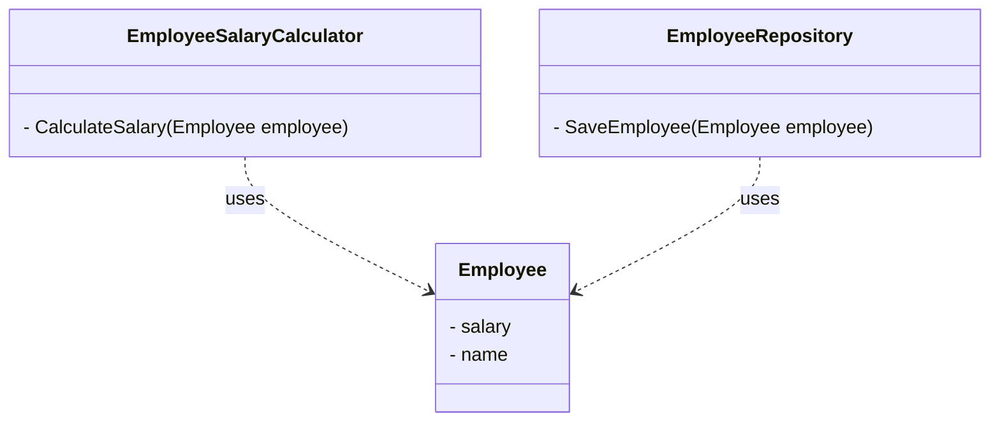
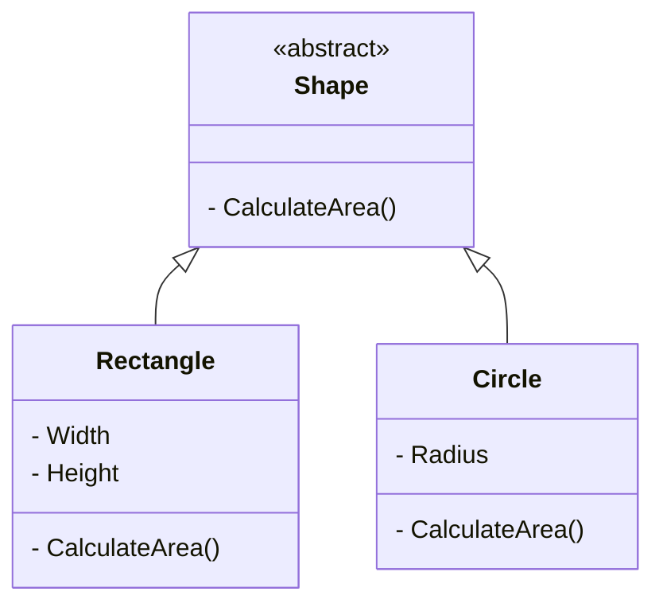
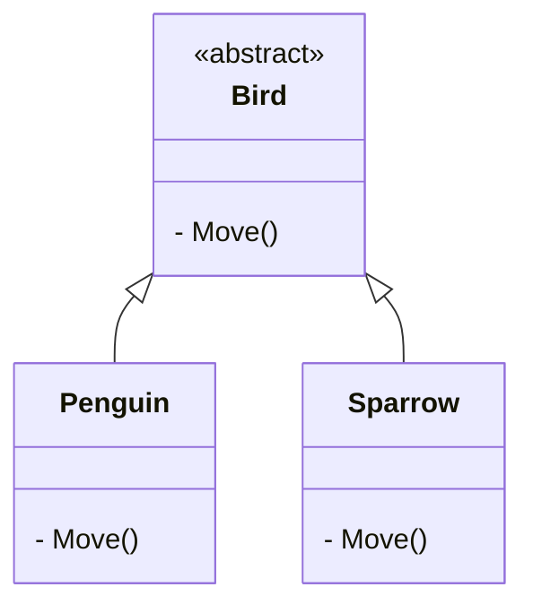
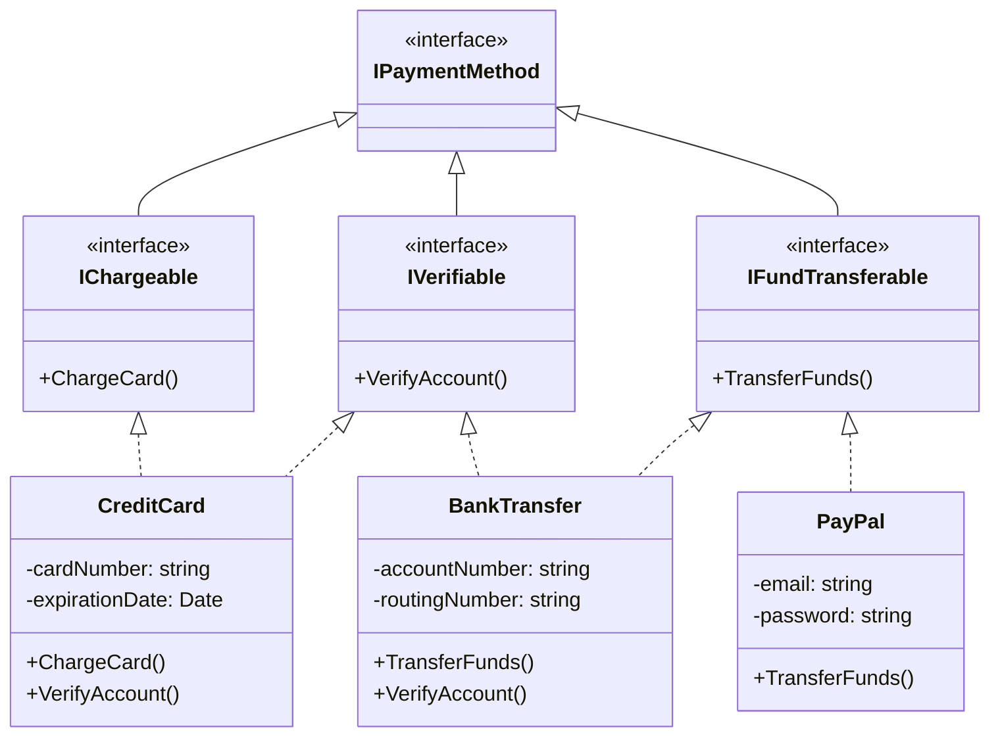
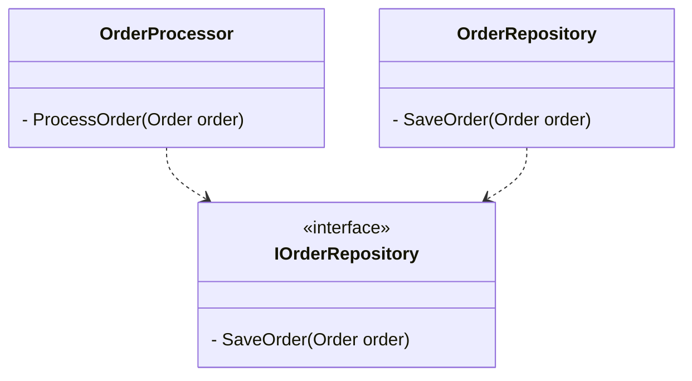

# SOLID Principles

SOLID is an acronym for five design principles in object-oriented programming and design. These principles help to create software that is easy to maintain, understand, and extend.

### Single Responsibility Principle (SRP)
A class should have only one reason to change. This means that a class should only have one responsibility or job.

Example:



```csharp
// Bad
public class Employee
{
    public void CalculateSalary()
    {
        // ...
    }

    public void SaveEmployee(Employee employee)
    {
        // ...
    }
}

// Good
public class EmployeeSalaryCalculator
{
    public double CalculateSalary(Employee employee)
    {
        // ...
    }
}

public class EmployeeRepository
{
    public void SaveEmployee(Employee employee)
    {
        // ...
    }
}
```

### Open-Closed Principle (OCP)
Software entities (classes, modules, functions, etc.) should be open for extension but closed for modification. This means that you should be able to add new functionality without changing the existing code.

Example:



```csharp
// Bad
public class Rectangle
{
    public double Width { get; set; }
    public double Height { get; set; }

    public double CalculateArea()
    {
        return Width * Height;
    }
}

public class Circle
{
    public double Radius { get; set; }

    public double CalculateArea()
    {
        return Math.PI * Radius * Radius;
    }
}

// Good
public abstract class Shape
{
    public abstract double CalculateArea();
}

public class Rectangle : Shape
{
    public double Width { get; set; }
    public double Height { get; set; }

    public override double CalculateArea()
    {
        return Width * Height;
    }
}

public class Circle : Shape
{
    public double Radius { get; set; }

    public override double CalculateArea()
    {
        return Math.PI * Radius * Radius;
    }
}
```
### Liskov Substitution Principle (LSP)
Subtypes must be substitutable for their base types. This means that if a class is a subtype of another class, it should be able to be used in the same way as the base class without any issues.

Example:



```csharp
// Bad
public class Bird
{
    public virtual void Fly()
    {
        // ...
    }
}

public class Penguin : Bird
{
    public override void Fly()
    {
        // Penguins can't fly
    }
}

// Good
public abstract class Bird
{
    public abstract void Move();
}

public class Penguin : Bird
{
    public override void Move()
    {
        // Penguins can't fly, but they can swim
    }
}

public class Sparrow : Bird
{
    public override void Move()
    {
        // Sparrows can fly
    }
}
```
### Interface Segregation Principle (ISP)
Clients should not be forced to depend on interfaces they do not use. This means that you should create specific interfaces for specific clients instead of creating one large interface that contains all the methods.

Example:



```csharp
// Bad
public interface IPaymentMethod
{
    void ChargeCard();
    void TransferFunds();
    void VerifyAccount();
    //...
}

// Good
public interface IChargeable
{
    void ChargeCard();
}

public interface IFundTransferable
{
    void TransferFunds();
}

public interface IVerifiable
{
    void VerifyAccount();
}

// Now, each payment method implements only the interfaces it needs
public class CreditCard : IChargeable, IVerifiable
{
    public void ChargeCard() { /* implementation */ }
    public void VerifyAccount() { /* implementation */ }
}

public class PayPal : IFundTransferable
{
    public void TransferFunds() { /* implementation */ }
}

public class BankTransfer : IFundTransferable, IVerifiable
{
    public void TransferFunds() { /* implementation */ }
    public void VerifyAccount() { /* implementation */ }
}

// Client code can now depend on the specific interfaces it needs
public class PaymentProcessor
{
    public void ProcessPayment(IChargeable paymentMethod)
    {
        paymentMethod.ChargeCard();
    }

    public void ProcessPayment(IFundTransferable paymentMethod)
    {
        paymentMethod.TransferFunds();
    }
}
```

### Dependency Inversion Principle (DIP)
High-level modules should not depend on low-level modules. Both should depend on abstractions. This means that you should depend on abstractions instead of concrete classes.

Example:


```csharp
// Bad
public class OrderProcessor
{
    private readonly OrderRepository _orderRepository;

    public OrderProcessor()
    {
        _orderRepository = new OrderRepository();
    }

    public void ProcessOrder(Order order)
    {
        // ...
    }
}

// Good
public interface IOrderRepository
{
    void SaveOrder(Order order);
}

public class OrderRepository : IOrderRepository
{
    public void SaveOrder(Order order)
    {
        // ...
    }
}

public class OrderProcessor
{
    private readonly IOrderRepository _orderRepository;

    public OrderProcessor(IOrderRepository orderRepository)
    {
        _orderRepository = orderRepository;
    }

    public void ProcessOrder(Order order)
    {
        // ...
        _orderRepository.SaveOrder(order);
    }
}
```
I like to mention that there are few methods other than dependency injection to fulfill DIP. I will provide some of them here:

### 1. Service Locator

A Service Locator is a centralized registry that provides access to dependencies. Instead of injecting dependencies through constructors or setters, components can request them from the Service Locator. This approach can be seen as a compromise between DI and manual instantiation.

**Example:**

```csharp
public class ServiceLocator
{
    private readonly Dictionary<Type, object> _services = new Dictionary<Type, object>();

    public void Register<T>(T service) where T : class
    {
        _services.Add(typeof(T), service);
    }

    public T Get<T>() where T : class
    {
        return (T)_services[typeof(T)];
    }
}

public class MyComponent
{
    public MyComponent()
    {
        var logger = ServiceLocator.Get<ILogger>();
        // use logger
    }
}

public interface ILogger
{
    void Log(string message);
}

public class ConsoleLogger : ILogger
{
    public void Log(string message)
    {
        Console.WriteLine(message);
    }
}

// Usage:
ServiceLocator locator = new ServiceLocator();
locator.Register(new ConsoleLogger());

MyComponent component = new MyComponent();
```
### 2. Factory Methods

Factory Methods are a creational pattern that allows you to encapsulate object creation. By using factory methods, you can decouple components from specific implementations and provide a way to swap out dependencies.

**Example:**
```csharp
public class LoggerFactory
{
    public static ILogger CreateLogger()
    {
        return new ConsoleLogger(); // or FileLogger, etc.
    }
}

public class MyComponent
{
    public MyComponent()
    {
        var logger = LoggerFactory.CreateLogger();
        // use logger
    }
}

public interface ILogger
{
    void Log(string message);
}

public class ConsoleLogger : ILogger
{
    public void Log(string message)
    {
        Console.WriteLine(message);
    }
}

public class FileLogger : ILogger
{
    public void Log(string message)
    {
        // log to file
    }
}
```
### 3. Plugin Architecture

A Plugin Architecture allows you to decouple components from specific implementations by using a common interface. Plugins can be loaded dynamically, providing a way to swap out dependencies.

**Example:**
```csharp
public interface ILogger
{
    void Log(string message);
}

public class ConsoleLogger : ILogger
{
    public void Log(string message)
    {
        Console.WriteLine(message);
    }
}

public class FileLogger : ILogger
{
    public void Log(string message)
    {
        // log to file
    }
}

public class PluginLoader
{
    public static ILogger LoadLogger(string pluginName)
    {
        if (pluginName == "console")
            return new ConsoleLogger();
        else if (pluginName == "file")
            return new FileLogger();
        else
            throw new ArgumentException("Invalid plugin name", nameof(pluginName));
    }
}

public class MyComponent
{
    public MyComponent(ILogger logger)
    {
        _logger = PluginLoader.LoadLogger("console");
    }

    private readonly ILogger _logger;

    public void DoSomething()
    {
        _logger.Log("Something happened");
    }
}

// Usage:
MyComponent component = new MyComponent();
```
### 4. Higher-Order Functions

Higher-Order Functions (HOFs) are functions that take other functions as arguments or return functions as output. By using HOFs, you can decouple components from specific implementations and provide a way to swap out dependencies.

**Example:**
```csharp
public delegate void LoggerDelegate(string message);

public class MyComponent
{
    public MyComponent(LoggerDelegate logger)
    {
        _logger = logger;
    }

    private readonly LoggerDelegate _logger;

    public void DoSomething()
    {
        _logger("Something happened");
    }
}

public class LoggerFactory
{
    public static LoggerDelegate CreateLogger(LoggerDelegate logger)
    {
        return logger;
    }
}

// Usage:
LoggerDelegate consoleLogger = (message) => Console.WriteLine(message);
LoggerDelegate fileLogger = (message) => { /* log to file */ };

MyComponent component1 = new MyComponent(LoggerFactory.CreateLogger(consoleLogger));
MyComponent component2 = new MyComponent(LoggerFactory.CreateLogger(fileLogger));
```
Note that in the Higher-Order Functions example, I used a delegate to represent the logger function. This is a simple way to demonstrate the concept, but in a real-world scenario, you might want to use a more robust approach, such as using a functional interface or a strategy pattern.

### Conclusion

SOLID principles are a set of guidelines for designing software that is easy to maintain, understand, and extend. By following these principles, you can create software that is more flexible, reusable, and testable.

In this notes, we have covered each of the five SOLID principles with examples in C#, also provided class-diagrams.

By applying these principles in your software design, you can create software that is more robust and less prone to errors. While it may take some time to learn and apply these principles, the benefits are well worth the effort.

**Remember, SOLID principles are not rules, but guidelines.** They are meant to help you make informed decisions about your software design. Use them wisely and you will create software that is easier to maintain, understand, and extend.
